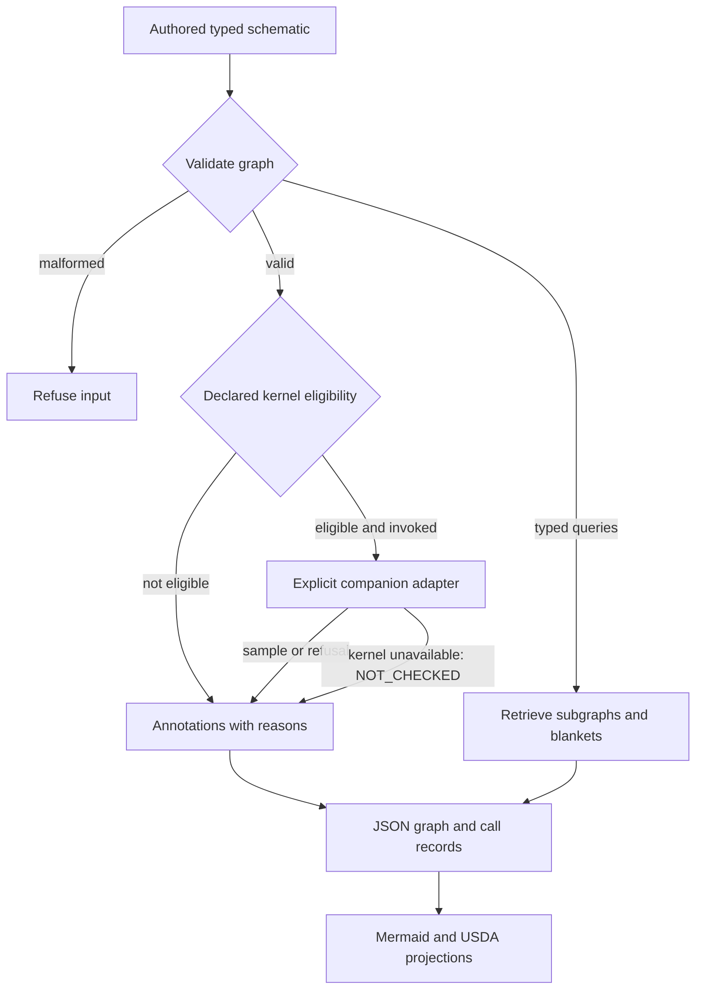

# System Graph

**Inspect typed system graphs, retrieve connected subgraphs and check eligibility for declared numerical calls.**

| NET micro-tool | Identity and scope |
| --- | --- |
| User-facing name | **System Graph** |
| Proposed NET operation family | `system.graph` |
| Implementation repository | `Schematics-Retrieval-Agent` |
| Existing provider | Schematics Retrieval Agent / SRA |
| Existing library and CLI | `schematics`; `sra` |
| Current boundary | Authored typed function/factor graphs, subgraph retrieval, eligibility checks and explicit companion calls |

`system.graph` is the agreed NET-facing name, **not a newly installed command,
a schematic-image OCR service or an implemented Blender/Godot node-editor plugin**.
Use the existing library and CLI below. Graph eligibility is not an executed
kernel result, and a graph projection is not an authoritative physical model.

NET owns session composition and dispatch; this provider owns typed graph
representation, retrieval and eligibility annotations. Evidence, operation
specifications, execution attempts and verification records remain distinct.
Repository URLs, imports, CLI flags, historical companion pins, contracts and
licence terms are unchanged. Retained pins below intentionally keep their
historical repository references rather than being relabelled as new evidence.

Part of **Notation Systems Inc's computational instrumentation and evidence infrastructure** for industrial and cyber-physical systems.

[Notations Engineering Terminal (CIW)](https://github.com/giasonpooni/Notations-Engineering-Terminal) · [Diagram atlas](https://github.com/giasonpooni/Notations-Engineering-Terminal/blob/main/docs/DIAGRAMS.md) · [Stack map](https://github.com/giasonpooni/Notations-Engineering-Terminal/blob/main/docs/STACK.md) · [Component role and interfaces](docs/STACK_ROLE.md)

Function-graph plus factor-graph IR for setting up observers on declared
nonlinear plants. The agent retrieves typed subgraphs, applies an eligibility
table, and writes fail-closed annotations.

Short name **SRA**. The reusable library import is `schematics`.

OpenUSD is a projection. This package is not a twin platform and does not
import JSPT, PLSR, RCI, or CSE at module load.

The central question is:

> Given an authored schematic, which subgraphs may call which kernel —
> and what remains UNRESOLVED?

## Organization

**Notation Systems Inc** is the parent organization.

| Division | Focus |
| --- | --- |
| **Notations Gaming** | Games, graphics and interactive worlds. |
| **Notations Manufacturing** | Industrial design, materials and manufacturing systems. |
| **Notations Laboratories** | Research, scientific computing, simulation and experimental validation. |

This repository is shared **Notation Systems Inc** tooling for evidence retrieval and system graph projections, supporting workflows across all three divisions.

## Routing and projections



Eligibility concerns a declared numerical call. Unknown plants remain
`UNRESOLVED`; neither a fixture matrix nor a rendered edge establishes a
current kernel result. The projections do not grant operating authority.

## Install and run

Python 3.12 or 3.13.

```bash
git clone https://github.com/giasonpooni/Schematics-Retrieval-Agent.git
cd Schematics-Retrieval-Agent
uv run --python 3.13 python examples/quickstart.py
uv run --python 3.13 python examples/unknown_plant.py
uv run --python 3.13 --with pytest pytest -q
```

CLI:

```bash
uv run --python 3.13 sra --fixture-A -o results
uv run --python 3.13 --extra jspt sra --call-jspt -o results
uv run --python 3.13 sra --rci-digest rci-displacement-digest-fixture -o results
```

`--extra jspt` installs the pinned `sensitivity` package into the same environment
that runs `--call-jspt`. Without that extra, an unavailable kernel returns
`NOT_CHECKED`. A fixture A does not open PLSR.

To exercise all pinned companion adapters, including the JSPT-to-PLSR path:

```bash
uv run --python 3.13 --dev --extra kernels pytest -q -m live
```

Explicit live tests require their dependencies and fail if one is absent. The
default suite excludes live tests; its missing-dependency cases simulate that
condition even when extras are installed.

Pin: `giasonpooni/Jacobian-Sensitivity-Propagation-Testbed@7399ab03087b27683620b4c57f97b2ac14546c7f`.

Dependent numerical routes require a current, content-bound Jacobian adapter
record. Legacy annotations remain readable, but stale or unbound matrices do not
open covariance, structure or Lyapunov calls. Content binding is not execution
authentication; see the precise boundary in [docs/KERNEL.md](docs/KERNEL.md).

See [docs/KERNEL.md](docs/KERNEL.md), [docs/SCOPE.md](docs/SCOPE.md),
and [docs/MAP.md](docs/MAP.md).

Contributor requirements: [CONTRIBUTING.md](CONTRIBUTING.md).

## License

MIT. See [LICENSE](LICENSE).
