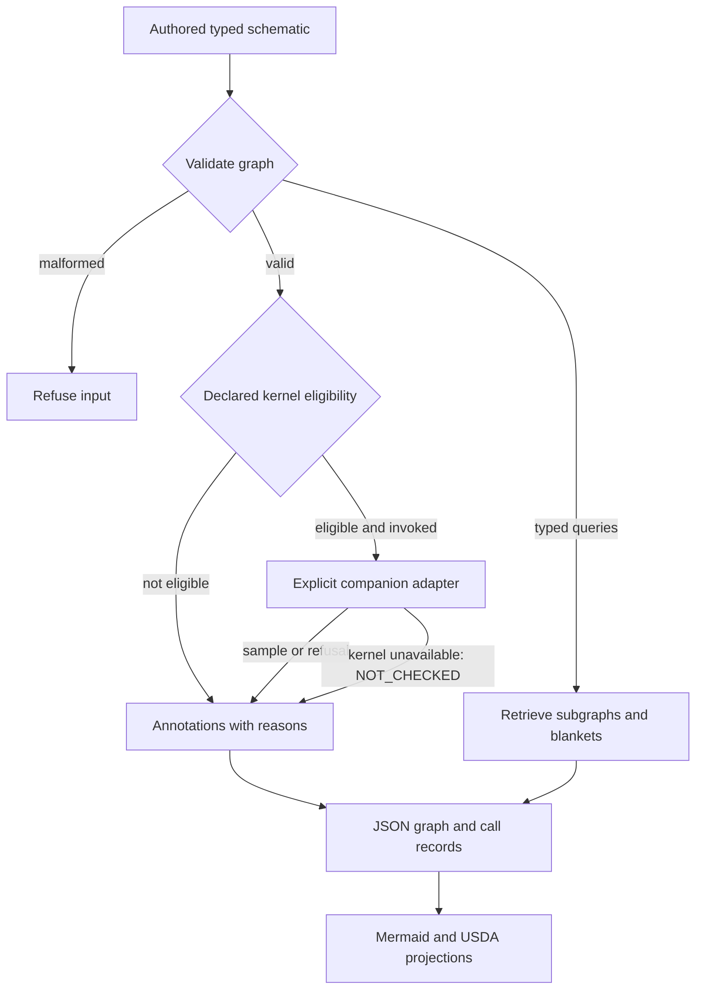

# Notations Retrieval Agent

**Inspect authored system graphs, retrieve typed subgraphs and check eligibility for explicit numerical calls.**

[Run](#install-and-run) · [Kernel boundary](docs/KERNEL.md) · [Research profile](#research-profile) · [Scope](docs/SCOPE.md)

## Organization

**Notation Systems Inc** is the parent organization: a scientific computing and systems engineering company developing computational instruments, software and interactive environments for understanding and building physical and virtual systems.

The company's development direction connects measurement, state estimation and sensor fusion, scientific modelling, simulation and execution, from materials and machines to interactive worlds.

| Division | Focus |
| --- | --- |
| **Notations Gaming** | Games, graphics, world building, interactive environments and gameplay simulation. |
| **Notations Manufacturing** | Design, machinery integration, process development, fabrication and production systems. |
| **Notations Laboratories** | Research and experimental validation in scientific computing, measurement, physics and chemistry modelling, materials and simulation. |

**Repository role:** System Graph is shared **Notation Systems Inc** tooling for authored typed graphs, connected subgraph retrieval and declared numerical call eligibility. It helps organize models and computational investigations across the divisions while NET retains session control and each application retains its own scientific or interactive state authority.

## Instrument role

**Frontier Tooling and Instrumentation for Digital Futures.** We develop computational instruments and operational tooling connecting scientific methods, specialized computation and human expertise.

[Notations Systems Terminal](https://github.com/atomtrapping/Notations-Systems-Terminal) composes supported investigations. This provider retains its typed graph, retrieval and eligibility implementation. ESM retains governed evidence; Notations Gaming develops interactive worlds, simulation technology and digital IP with separate creative state and approval. [Current organization](#organization).

## Identity and scope

| Identity | Value |
| --- | --- |
| Capability | **System Graph** |
| Current repository | `Notations-Retrieval-Agent` |
| Existing provider | Schematics Retrieval Agent / SRA |
| Library / CLI | `schematics` / `sra` |
| Proposed NET family | `system.graph` |
| Implemented boundary | Authored typed function/factor graphs, retrieval, eligibility annotations and explicit companion calls |

This is a function-graph plus factor-graph representation for observer setup on declared nonlinear plants. OpenUSD is a projection. It is not schematic-image OCR, a general twin platform or a Blender/Godot editor plugin. Modules do not import JSPT, PLSR, RCI or CSE at load time.

[Notations Inference Schematics Engine](https://github.com/atomtrapping/Notations-Inference-Schematics-Engine) is a separate project, not a silent rename or replacement of SRA. Integration must preserve existing records, pins and eligibility semantics.

## Routing and projections



The question is: **which subgraphs may call which kernel, and what remains unresolved?** Eligibility is not a completed numerical call. Unknown plants remain `UNRESOLVED`; fixture matrices and rendered edges do not establish a current result. Projections grant no operating authority.

## Install and run

Python 3.12/3.13:

```sh
git clone https://github.com/atomtrapping/Notations-Retrieval-Agent.git
cd Notations-Retrieval-Agent
uv run --python 3.13 python examples/quickstart.py
uv run --python 3.13 python examples/unknown_plant.py
uv run --python 3.13 --with pytest pytest -q
```

CLI:

```sh
uv run --python 3.13 sra --fixture-A -o results
uv run --python 3.13 --extra jspt sra --call-jspt -o results
uv run --python 3.13 sra --rci-digest rci-displacement-digest-fixture -o results
```

`--extra jspt` installs the pinned `sensitivity` package into the calling environment. Without it, an unavailable kernel returns `NOT_CHECKED`. Fixture A does not open PLSR.

For all pinned companion adapters, including JSPT-to-PLSR:

```sh
uv run --python 3.13 --dev --extra kernels pytest -q -m live
```

Explicit live tests require dependencies and fail when absent. The default suite excludes live tests; missing-dependency cases simulate absence even when extras are installed.

Historical pin retained: `giasonpooni/Jacobian-Sensitivity-Propagation-Testbed@7399ab03087b27683620b4c57f97b2ac14546c7f`.

Dependent numerical routes require a current content-bound Jacobian adapter record. Legacy annotations remain readable, but stale/unbound matrices do not enable covariance, structure or Lyapunov calls. Binding is not execution authentication. See [kernel contract](docs/KERNEL.md).

## Research profile

**Question:** what graph structure and numerical evidence must be present before a composed operation is eligible? Use authored known/unknown plants and available/unavailable companion cases as bounded specimens.

Evaluate retained uncertainty, refusal reasons, dependency closure and actual downstream outcomes—not only subgraph size. Retrieval must not drop external coupling or convert an annotation into physical truth. Proposed automation and information-efficient context need held-out comparisons and total cost measurements.

[Historical research protocol](https://github.com/atomtrapping/Notations-Systems-Terminal/blob/b41b84922d4963a9206202029afd1e78b9451f9c/RESEARCH_PROGRAMME.md). Python/Julia/Rust/C++ and CUDA providers remain separately qualified implementations, not automatic capabilities of this graph layer.

## Documentation and compatibility

[Kernel](docs/KERNEL.md) · [Scope](docs/SCOPE.md) · [Map](docs/MAP.md) · [Stack role](docs/STACK_ROLE.md) · [Contributing](CONTRIBUTING.md)

Existing `schematics`, `sra`, NET / `net` / `ciw`, flags, source pins, schema and evidence/specification/execution/verification identities remain. `system.graph` is not newly registered by this text. No source, tests, dependencies, licence, permissions, deployment or release changes; no new runtime qualification is claimed.

## License

[MIT](LICENSE). Existing source and third-party notices remain in force. Public-interest and private-IP positioning does not transfer rights or establish nonprofit status.
