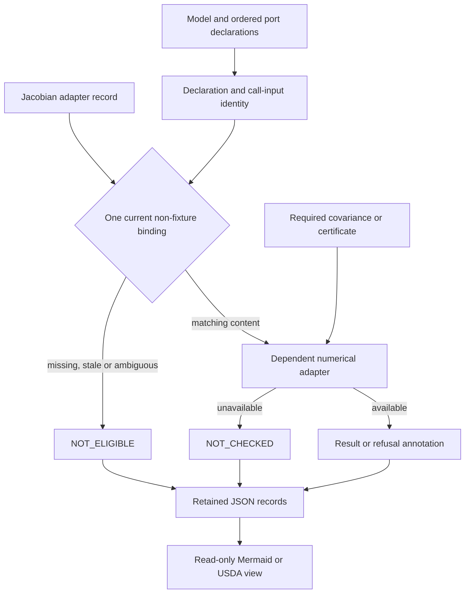

# Schematics Retrieval Agent in the instrumentation stack

Notation Systems develops computational instrumentation and evidence infrastructure for industrial and cyber-physical systems.
This component owns **typed schematic retrieval and kernel eligibility**. The [stack map](https://github.com/atomtrapping/Notations-Systems-Terminal/blob/main/docs/STACK.md) locates all public components and distinguishes implemented paths from specifications and scaffolds.

## Current boundary

| Property | Scope |
| --- | --- |
| Implementation | Executable graph and optional companion adapters |
| Workbench connection | Standalone; no CIW adapter |
| Inputs | Authored function/factor graphs, explicit model references and optional bound measurement records. |
| Outputs | Retrieved subgraphs, eligibility decisions, numerical adapter annotations and read-only projections. |

Eligibility routes a declared computation; it grants no physical operating authority. Fixture linearizations remain distinct from live kernel results.

## Binding before dependent calls

Solid arrows show implemented routing and record projection. Dependent calls
cover local structure, covariance and optional Lyapunov evaluation; each retains
its own required inputs and eligibility checks. A fixture or unbound matrix
cannot substitute for the current Jacobian record. Stale values remain historical
records, not current results. Binding checks content consistency and declared
pins; it does not authenticate execution. JSON carries replay records; USDA is a
display projection, not lossless execution interchange. No CIW adapter is present.

See the [diagram atlas](https://github.com/atomtrapping/Notations-Systems-Terminal/blob/main/docs/DIAGRAMS.md) for the wider system.

## Interoperability

Integrations use the component's documented contract and an explicit adapter. They preserve source observations, ordered quantities, units, coordinate/frame meaning, time semantics, missingness and declared uncertainty where applicable. An unimplemented field or conversion must be reported as unsupported rather than silently inferred.

Evidence identity names the source record; operation identity names the versioned computation; execution identity names an invocation; result identity names its output; verification identity names a scoped check. These are integration requirements, not a claim that every standalone repository already implements all five record types.

Display names and repository locations do not rename packages, schemas, operation IDs, retained corpus keys or historical runtime pins. CIW integrations use the exact source revisions named in its runtime manifests and operating guides; a provider's current default branch is not a substitute for that binding. Published numerical records retain their original run scope.

## Technical references

- [Overview and runnable instructions](../README.md)
- [docs/KERNEL.md](KERNEL.md)
- [docs/SCOPE.md](SCOPE.md)
- [docs/MAP.md](MAP.md)

Private customer state, deployment configuration and calibration knowledge are outside this public component description. Applicable repository licenses and source-data rights remain controlling; a shared stack identity is not a license grant or a change of repository visibility.
